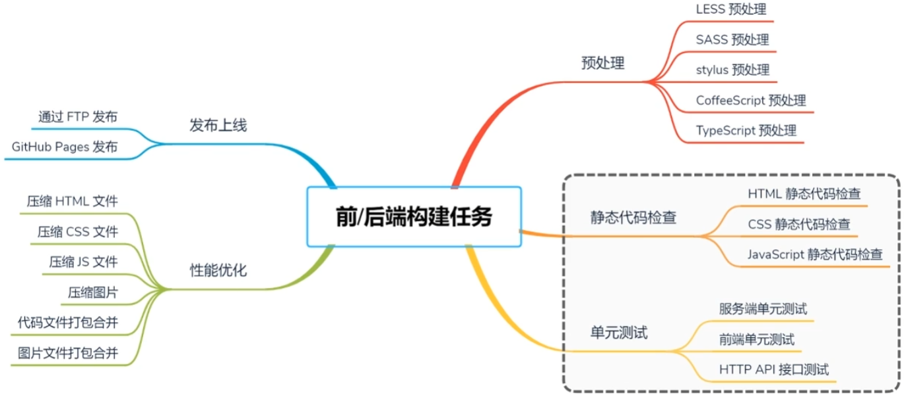

构建

目的：生成可执行程序

通俗来讲：材料的拼装生成一个产品（煎饼果子）

c语言构建

编译、链接

前/后端构建

构建的任务分为5大类 ：预处理 静态代码检查 单元测试 性能优化 发布上线

其中后端构建只有两类，静态代码检查和单元测试

狭义的构建

比如c语言项目的构建：编译、链接

广义的构建

版本控制 自动化构建 自动化测试 持续集成  自动发布 持续提交

自动化构建需要软件工具的支持以及脚本

构建模式

调试模式（debug） 发布模式（release）

三种环境

开发、测试、生产

通过不同的构建模式得到不同类型的应用后，发布到不同的代码环境

自动化构建

需要三大类软件的支持：版本控制工具、构建任务工具、持续集成工具

版本控制工具：git、github

构建任务工具：grunt、gulp、webpack、npm，其中前两个以构建任务为核心去完成自动化构建，webpack打包工具都算不上构建工具，他是以文件为核心来完成构建操作，npm这个包管理工具也可以作为任务管理工具，因为再npm生成的packagejosn文件中可以写js脚本，一般在后端能用到。

这里多说几句，不同的构建任务工具里面可以写不同构建模式的脚本，比如说在debug模式中就不需要写性能优化的构建脚本

持续集成工具：jenkins、travis CI
